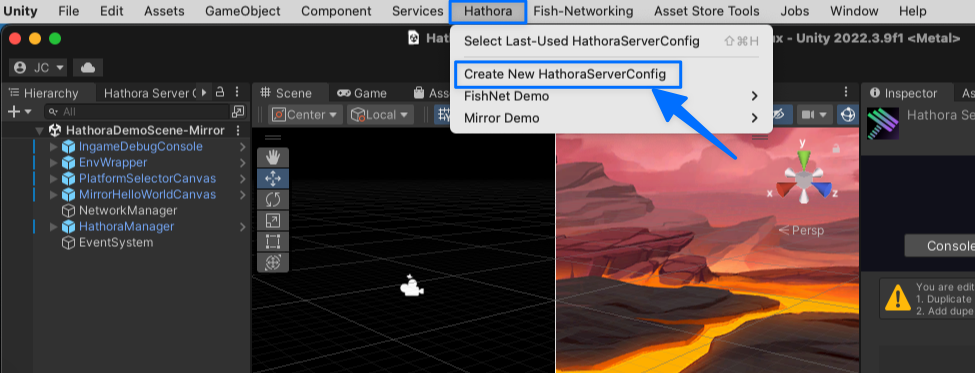
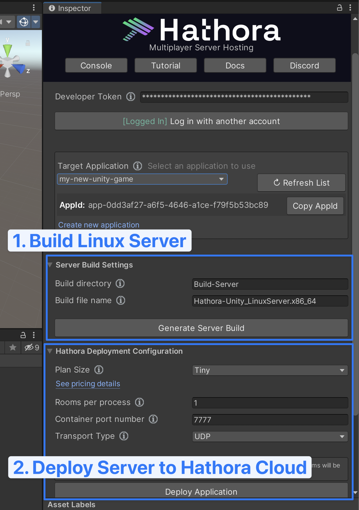

# Hathora Cloud Unity Plugin

Download the plugin: [Hathora_Cloud_Unity_plugin_latest.unitypackage](https://raw.githubusercontent.com/hathora/unity-plugin/main/UnityPackage/Hathora_Cloud_Unity_plugin_latest.unitypackage)

**Hathora Cloud Unity Plugin** includes:
* Editor plugin to configure, build, and deploy your server directly from your Unity editor
* Hathora Cloud C# SDK for programmatic integration
* Demos directory with sample integrations with FishNet and Mirror networking solutions

For in-depth tutorial on using our plugin, check out our [Beginner's tutorial](https://hathora.dev/docs/engines/unity/beginners-tutorial).

For a guide on using our plugin with your existing multiplayer game, check out our [Integration guide](https://hathora.dev/docs/engines/unity/integration-guide).

## Install instructions

Our plugin works best with Unity version `2021.3.28f1` and higher. It will still work with earlier version of `2021.3.x`, see "Version Compatability" section below.

### 1. Download [Hathora_Cloud_Unity_plugin_latest.unitypackage](https://raw.githubusercontent.com/hathora/unity-plugin/main/UnityPackage/Hathora_Cloud_Unity_plugin_latest.unitypackage)
### 2. Open the Unity project you want to add the plugin to
### 3. Add `Hathora_Cloud_Unity_plugin_latest.unitypackage` as a "Custom Package" (`Assets` > `Import Package` > `Custom Package..`)

   

### 4. Using the Config Finder window, create a new config file

   

### 5. Create or login to your Hathora Cloud account using the Editor inspector on your newly created config file from the previous step

   

### 6. Create an application in Hathora Cloud

   

   

### 7. Now you can use the plugin to build and deploy your game server.

   

### 8. To learn more about the demos included, check out [this tutorial](https://hathora.dev/docs/engines/unity/beginners-tutorial).

   

## Questions?

Get help and ask questions in our active Discord community:
[https://discord.com/invite/hathora](https://discord.com/invite/hathora)

## Version compatibility

Our plugin works best with Unity version `2021.3.28f1` or higher.

It does still work for earlier versions of `2021.3.x`, but you will need to fix the Universal Render Pipeline (URP) package version. Note that URP is only used for our included demos, so if you simply ignore/delete the Demo folder, you can ignore the URP dependency.

1. `Window` > `Package Manager` > remove Universal RP
2. Find package via Unity Registry > install Universal RP (should be version compatible with your Unity version)
3. `Edit` > `Project Settings` > `Graphics` > set "Scriptable Render Pipeline Settings" to `StarterAssetsURP`
