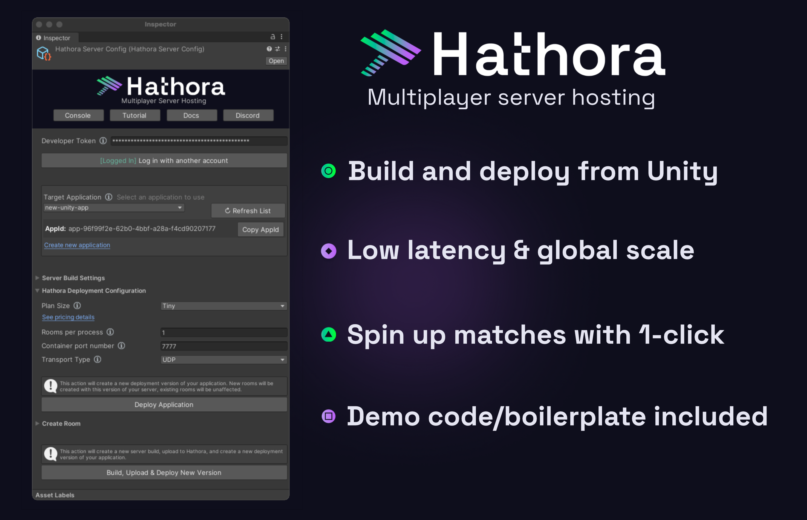

# Hathora Cloud Unity Plugin

The plugin-only version of the Hathora Unity Plugin is the same as the base version, except it excludes:
- `/Demo` directory (demo scenes for FishNet and Mirror networking)
- No package dependencies

We recommend this version for integrating your existing game with Hathora Cloud.

[Download plugin-only package](https://raw.githubusercontent.com/hathora/unity-plugin/main/UnityPackage/plugin-only/Hathora_Cloud_Unity_pluginonly_latest.unitypackage)

For a guide on using our plugin with your existing multiplayer game, check out our [Integration guide](https://hathora.dev/docs/engines/unity/integration-guide).

## Troubelshooting

- When installing the plugin-only package, you may notice errors around Newtonsoft package missing. If you do, you will need to install Newtonsoft via Unity's Package Manager. You can do so by adding the package by name: `com.unity.nuget.newtonsoft-json`.
- For other troubleshooting tips, check out: [common issues](https://hathora.dev/docs/engines/unity/beginners-tutorial#troubleshooting).

## Questions?

Get help and ask questions in our active Discord community:
[https://discord.com/invite/hathora](https://discord.com/invite/hathora)
